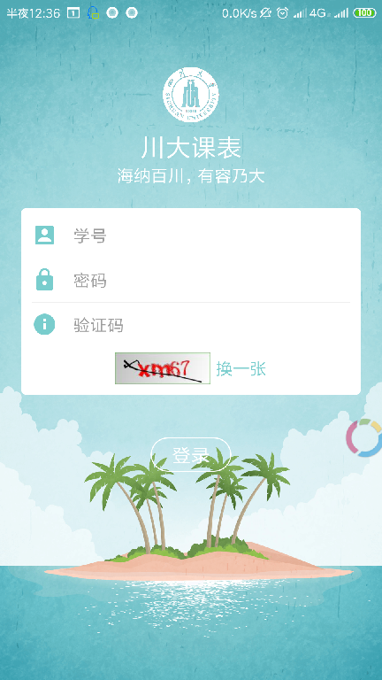
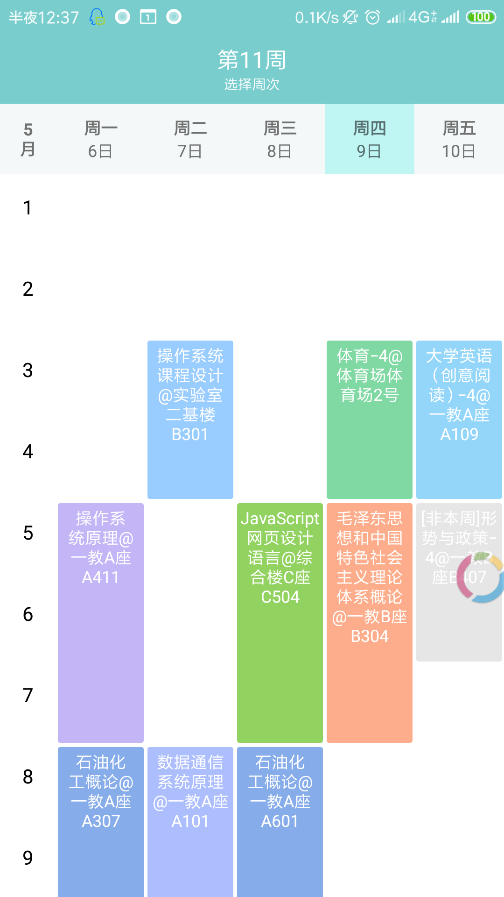

# scuTimetable
一个简单的四川大学课程表android客户端（~~由于川大教务系统更新了，可能该软件已不能使用~~）。

# 截图

# 更新日志
### v1.0.0
    ### 川大课表第一个版本
    ### v1.0.0版本是我初学Android时写的，时隔几月，发现代码又臭又长，惨不忍睹，哈哈~
    ### 居然有人star了该项目，快感动哭了，决定更新软件！
    
### v1.1.0
    ### 特别感谢开源项目https://github.com/zfman/TimetableView
    ### 更新内容：1.重写软件，更换包名为com.scu.timetable
    ###          2.全新登录界面，全新课表展示界面呢
    ###          3.修复由于川大教务系统更换后无法登录的问题
### v1.1.0截图
 
    
