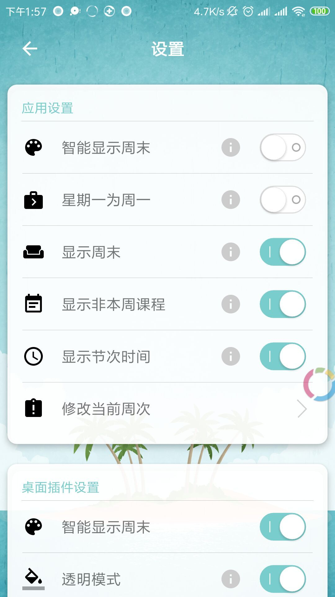

# 川大课程表ScuTimetable
川大课程表安卓应用，模拟登录四川大学教务系统，获取课程表信息并展示，支持一键评教，课程表桌面插件。

软件已上架手机乐园，[下载地址](https://soft.shouji.com.cn/down/1555815.html)

## 截图

    
    
    
    
    
    
    
    
    
    
    

## 更新日志
### v1.5.0
    2019/06/02
    更新内容：1.支持查看其他学期的课表信息
             2.支持一键评教
             3.增加检查更新功能

### v1.4.0
    2019/05/16
    更新内容：1.新增桌面插件透明模式
             2.新增注销登录功能
             3.新增课表刷新功能
             4.完善课程详细信息查看
             5.完善备注功能
             6.修复一些bug
#### v1.4.0截图

    
    
    
    

### v1.3.0
    2019/05/12
    更新内容：1.新增菜单和设置，支持设置智能显示周末，设置星期一为周一，显示非本周课程，显示节次时间等操作
             2.新增查看课程详情(待完善)
             3.新增课程备注功能(待完善)
             4.修复周数改变后课表显示有错误的bug
             5.修复某些情况下日期栏显示当前星期几不对的bug
             6.修复点击空白位置显示旗标位置不对的bug
#### v1.3.0截图

    
    
    
    

### v1.2.0
    2019/05/10
    更新内容：1.增加桌面插件，方便快捷的查看课表
             2.其他优化
#### v1.2.0截图

    
    

### v1.1.0
    2019/05/08
    特别感谢开源项目https://github.com/zfman/TimetableView
    更新内容：1.重写软件，更换包名为com.scu.timetable
             2.全新登录界面，全新课表展示界面呢
             3.修复由于川大教务系统更换后无法登录的问题
#### v1.1.0截图

    
    

### v1.0.0
    ### 川大课表第一个版本
    ### v1.0.0版本是我初学Android时写的，时隔几月，发现代码又臭又长，惨不忍睹（虽然现在仍然很糟糕），哈哈~
    ### 居然有人star了该项目，快感动哭了，决定重构软件！

## 该项目使用或参考了以下开源库
[ZDownloader](https://github.com/Z-P-J/ZDownloader)

[ZHttp](https://github.com/Z-P-J/ZHttp)

[ZSettingItem](https://github.com/Z-P-J/ZSettingItem)

[Fragmentation](https://github.com/Z-P-J/Fragmentation)

[TimetableView](https://github.com/zfman/TimetableView)

[Glide](https://github.com/bumptech/glide)

[StateButton](https://github.com/niniloveyou/StateButton)

[AVLoadingIndicatorView](https://github.com/81813780/AVLoadingIndicatorView)

[AES-NDK](https://github.com/ray-tianfeng/AES-NDK)

